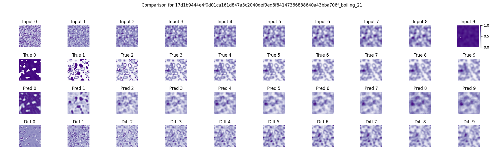

# Spatio Temporal

This repository contains a minimalist implementation of SimVP from the [OpenSTL Benchmark](https://github.com/chengtan9907/OpenSTL). 
You can read more about SimVP in the original papers [SimVP: Simpler yet Better Video Prediction](https://arxiv.org/abs/2206.05099) and 
[SimVP: Towards Simple yet Powerful Spatiotemporal Predictive Learning](https://arxiv.org/abs/2211.12509).

## Environment Options

- **Cross-Platform**: The codebase functions identically across all platforms; only the command syntax differs. Choose the appropriate guide based on your operating system and preferred terminal.

- **Linux/macOS/WSL2**: Use the instructions in this README.md file for Unix-like environments. This includes native Linux installations, macOS, and the Windows Subsystem for Linux (WSL2).

- **Windows (Native)**: For users running directly on Windows using PowerShell or Command Prompt, refer to the [WINDOWS.md](WINDOWS.md) file which contains equivalent commands adapted for Windows syntax.

## Repository Structure

```
simvp_minimal/
├── config/
│   └── SimVP.py
├── simvp_minimal/
│   ├── __init__.py
│   ├── config_utils.py
│   ├── dataset.py
│   ├── experiment.py
│   ├── experiment_recorder.py
│   ├── metrics.py
│   ├── simvpgsta_model.py
│   └── utils.py
├── tools/
│   ├── data/
│   │   ├── create_dataloader.py
│   │   └── generate_boiling_data.py
│   ├── run/
│   │   ├── dist_test.sh
│   │   ├── dist_train.sh
│   │   ├── test.py
│   │   └── train.py
│   └── visualize/
│       └── visualize_grid.py
├── requirements.txt
├── setup.py
└── README.md
```

## Environment Setup

We recommend setting up your environment as follows:

```bash
export MY_DESIRED_PYTHON_VERSION="3.10"
export MY_ENV_NAME='simvp_minimal'
conda deactivate
conda create -y -n $MY_ENV_NAME
conda activate $MY_ENV_NAME
conda install -y python==$MY_DESIRED_PYTHON_VERSION
```

Install the package and dependencies:

```bash
pip install .
```

### Removing the Environment (If Needed)

If you need to remove the environment later:

```bash
conda deactivate
conda remove --name $MY_ENV_NAME --all
```

## Generating Simulation Data

This repository includes tools for generating synthetic spatiotemporal data. The framework supports any spatiotemporal data, but we provide a boiling water simulation as an example.

The data generation process consists of two main steps:
1. Generate and simulate data
2. Prepare data loaders for model training

### Step 1: Generate Boiling Simulation Data

The `generate_boiling_data.py` script creates and simulates the boiling water phenomenon:

```bash
python tools/data/generate_boiling_data.py --num_samples 100 --num_frames 20 --data_path ./boiling_data --increment 10 --image_size 64
```

Parameters:
- `--num_samples`: Number of different simulations to generate
- `--num_frames`: Number of frames per simulation
- `--data_path`: Directory to store the generated data
- `--increment`: Boiling simulation temperature increment (default: 10)
- `--image_size`: Size of the simulation grid (default: 64)

This will create a directory structure with unique IDs for each simulation:
```
boiling_data/
├── 07cf3359af320f9135d10c221d498c0382e527bf42b1357210ecdbb430189536_boiling_0/
│   ├── 0.npy
│   ├── 1.npy
│   └── ...
├── 1e7e3e039d708148d029f601213983794d5e00fd62b962691be86cde0a7c87fe_boiling_1/
│   ├── 0.npy
│   ├── 1.npy
│   └── ...
└── ...
```

Each simulation folder contains sequential NumPy files representing frames in the simulation. The simulations model temperatures ranging from 0°F to 212°F (boiling point), but are automatically normalized to the range [0, 1] before being saved to disk.

### Step 2: Create Data Loaders

Next, prepare the data for model training using `create_dataloader.py`:

```bash
python tools/data/create_dataloader.py --data_path ./boiling_data --train_ratio 0.7 --val_ratio 0.15 --total_length 20
```

Parameters:
- `--data_path`: Path to the simulation data 
- `--train_ratio`: Proportion of data for training (default: 0.7)
- `--val_ratio`: Proportion of data for validation (default: 0.15)
- `--total_length`: Number of frames to use per sample
- `--num_samples`: Number of samples to randomly select (default: all)
- `--sample_start_index`: Starting frame index, -1 for random (default: 0)
- `--init_final_only`: Use only initial and final frames
- `--reverse`: Reverse the frame order

This creates a JSON file in the data directory containing paths to the simulation data, split into training, validation, and test sets. The JSON file is used by the training scripts via the SP_Dataset class in `simvp_minimal/dataset.py`.

## Model Training

Now you can train a SimVP model using the generated data. First, locate your dataloader JSON file:

```bash
# Find the path to your dataloader JSON file
ls ./boiling_data/*_loaders.json
export LOADER_FILE='./boiling_data/[HASH_VALUE]_loaders.json'
```

### Single-GPU Training

To train on a single GPU or CPU:

```bash
python tools/run/train.py \
  --datafile_in $LOADER_FILE \
  --pre_seq_length 10 \
  --aft_seq_length 10 \
  --epoch 20 \
  --batch_size 8 \
  --val_batch_size 8 \
  --config_file ./config/SimVP.py \
  --ex_name my_experiment \
  --checkpoint_interval 5 \
  --auto_resume
```

Key Parameters:
- `--datafile_in`: Path to the dataloader JSON file
- `--pre_seq_length`: Number of input frames for prediction
- `--aft_seq_length`: Number of output frames to predict
- `--epoch`: Number of training epochs
- `--batch_size`: Training batch size
- `--val_batch_size`: Validation batch size
- `--config_file`: Path to model configuration file
- `--ex_name`: Experiment name (default: "Debug")
- `--device`: Computing device (cpu or cuda)
- `--test`: Add this flag to run inference after training completes
- `--no_display_method_info`: Suppress display of model parameters and info
- `--checkpoint_interval`: How often to save model checkpoints, in epochs (saves every N epochs). If omitted, only the best model (simvp_model.pth) will be saved.
- `--auto_resume`: Automatically resume training from the latest checkpoint (latest.pth) if training was interrupted. If omitted, training will always start from scratch.

### Distributed Training

For distributed training on multiple GPUs:

```bash
# Train on 4 GPUs
bash tools/run/dist_train.sh 4 \
  --datafile_in $LOADER_FILE \
  --pre_seq_length 10 \
  --aft_seq_length 10 \
  --epoch 20 \
  --batch_size 8 \
  --val_batch_size 8 \
  --config_file ./config/SimVP.py \
  --ex_name distributed_experiment \
  --checkpoint_interval 5 \
  --auto_resume
```

The first argument to the script specifies the number of GPUs to use. The distributed training script uses PyTorch's `torchrun` to manage multiple processes.

## Inference

You can run inference in two ways:

### Option 1: Using the test script

```bash
python tools/run/test.py \
  --datafile_in $LOADER_FILE \
  --pre_seq_length 10 \
  --aft_seq_length 10 \
  --config_file ./config/SimVP.py \
  --ex_name my_experiment
```

### Option 2: Adding the --test flag during training

```bash
python tools/run/train.py \
  --datafile_in $LOADER_FILE \
  --pre_seq_length 10 \
  --aft_seq_length 10 \
  --epoch 20 \
  --batch_size 8 \
  --val_batch_size 8 \
  --config_file ./config/SimVP.py \
  --ex_name my_experiment \
  --test \
  --checkpoint_interval 5 \
  --auto_resume
```

This will automatically run inference on the test set after training completes, saving time and ensuring the model is evaluated directly after training.

### Distributed Testing

For distributed testing on multiple GPUs:

```bash
# Test on 4 GPUs
bash tools/run/dist_test.sh 4 \
  --datafile_in $LOADER_FILE \
  --pre_seq_length 10 \
  --aft_seq_length 10 \
  --config_file ./config/SimVP.py \
  --ex_name my_experiment
```

## Configuration Files

The model configuration is specified in Python files in the `config` directory. For example, `config/SimVP.py` might contain:

```python
# Model configuration example
model_type = 'gsta'  # Model type
hid_S = 64  # Hidden dimension
hid_T = 512  # Temporal hidden dimension
N_S = 4  # Number of spatial blocks
N_T = 8  # Number of temporal blocks
```

These configuration files allow you to customize the model architecture without modifying the code. You can specify the configuration file with the `--config_file` argument:

```bash
python tools/run/train.py --config_file ./config/SimVP.py ...
```

## Visualizing Results

After training and inference, you can visualize the model predictions. The visualization script requires two main parameters:
1. The base directory containing the saved model outputs
2. A sample ID, which is the name of one of the subfolders in the inputs/trues/preds directories

First, list the available sample IDs (these are the subfolder names in the saved inputs directory):

```bash
# List available sample IDs
ls ./work_dirs/my_experiment/saved/inputs/
```

Example output (truncated for brevity):
```
17d1b9444e4f0d01ca161d847a3c2040def9ed8f84147366838640a43bba706f_boiling_21
25760aa4da991913e397940410c590e45339826fa84cf1cf6ee169d9036a567c_boiling_74
341d0f587fc11cbcd40531292176af939800af55daaed5ed2e19ed7c8b0f0c0a_boiling_93
36680ad40b2dc1b66fa16598bd30adcd4c54ba204dbb5871a6c4b59c2c304d20_boiling_9
41fd6c3649522995cd8160ff6824596174100acdb58462cc09637b61362f0ba5_boiling_17
...
f08296ae7c486b29f5ff4429d67f9c127d6ed5f614e414776e5b8edcb1ccb9ce_boiling_39
```

Then run the visualization script with the chosen sample ID:

```bash
# Visualize a specific sample by its ID
python tools/visualize/visualize_grid.py ./work_dirs/my_experiment/saved 17d1b9444e4f0d01ca161d847a3c2040def9ed8f84147366838640a43bba706f_boiling_21 --colormap Purples --save
```

The visualization script will generate a PNG file named `grid_[SAMPLE_ID].png` in your current working directory. For example: `grid_17d1b9444e4f0d01ca161d847a3c2040def9ed8f84147366838640a43bba706f_boiling_21.png`

The generated grid image shows:
- 1st Row: Input frames (frames given to the model)
- 2nd Row: Ground truth future frames (frames the model tries to predict)
- 3rd Row: Predicted frames (frames the model generated)
- 4th Row: Difference frames (residual between ground truth and predicted frames)

This grid provides a visual comparison between the input sequence, actual future frames, and the model's predictions.

## Understanding the Output Directory Structure

When you run training and inference, the code will create a structured output directory under `./work_dirs/[ex_name]/`. Here's what you can expect to find:

```
work_dirs/
└── my_experiment/
    ├── checkpoints/
    │   ├── epoch_5.pth
    │   ├── epoch_10.pth
    │   ├── epoch_15.pth
    │   ├── epoch_20.pth
    │   └── latest.pth
    ├── saved/
    │   ├── inputs/
    │   │   ├── [SAMPLE_ID]/
    │   │   │   ├── 0.npy
    │   │   │   ├── 1.npy
    │   │   │   └── ...
    │   │   └── ...
    │   ├── metrics.npy
    │   ├── preds/
    │   │   ├── [SAMPLE_ID]/
    │   │   │   ├── 0.npy
    │   │   │   ├── 1.npy
    │   │   │   └── ...
    │   │   └── ...
    │   └── trues/
    │       ├── [SAMPLE_ID]/
    │       │   ├── 0.npy
    │       │   ├── 1.npy
    │       │   └── ...
    │       └── ...
    └── simvp_model.pth
```

### Key Files and Directories:

1. **checkpoints/**: Contains model weights saved during training.
   - `epoch_X.pth`: Periodic checkpoints saved at intervals specified by `--checkpoint_interval`.
   - `latest.pth`: Symbolic link to the latest checkpoint for resuming training.

2. **saved/**: Organized directories containing:
   - `inputs/`: The input frame sequences provided to the model.
   - `preds/`: The predicted future frames generated by the model.
   - `trues/`: The ground truth future frames for comparison.
   - `metrics.npy`: Numerical metrics data.

3. **simvp_model.pth**: The best model according to validation metrics.

## Using Custom Data

The framework supports any spatiotemporal data, not just the boiling simulation. Simply organize your data in a similar format:
- Each sample in its own directory
- Sequential frames as numbered NumPy files (0.npy, 1.npy, etc.)
- Data should be pre-normalized to the range [0, 1]
- Use `create_dataloader.py` to prepare the data loader JSON file

The `SimVP_Dataset` class in `simvp_minimal/dataset.py` will handle loading the data for training and testing. This allows the model to work with any type of spatiotemporal data that follows this format.

## Complete Workflow Example

> **Note:** This example was completed on *Windows Subsystem for Linux 2 (WSL2)* running `Ubuntu 22.04.4 LTS`

Here's a detailed example of running the complete workflow from data generation to visualization, showing actual terminal outputs:

```bash
(simvp_minimal) user@hostname:~/projects/simvp_minimal$ python tools/data/generate_boiling_data.py --num_samples 100 --num_frames 20 --data_path ./boiling_data --increment 10 --image_size 64
Path './boiling_data' does not exist. Creating...
Step 1: Generating initial conditions...
Generating initials: 100%|██████████████████████████████████████████████████████████| 100/100 [00:00<00:00, 3941.01it/s]
Generating 100 initials took 0.03 seconds.
Step 2: Generating frame sequences...
Generating samples: 100%|████████████████████████████████████████████████████████████| 100/100 [00:00<00:00, 335.56it/s]
Generating samples took 0.30 seconds.
Dataset generation complete. Data saved to ./boiling_data
```

The data generation creates a series of boiling simulations. Next, create the data loaders:

```bash
(simvp_minimal) user@hostname:~/projects/simvp_minimal$ python tools/data/create_dataloader.py --data_path ./boiling_data --train_ratio 0.7 --val_ratio 0.15 --total_length 20
Loading files from data folder...
Loading samples: 100%|█████████████████████████████████████████████████████████████| 100/100 [00:00<00:00, 27661.44it/s]
Splitting 100 samples into train/validation/test sets...
Unique Experiment ID: f7b886c23b59a1415897b9b58570c686bb4221c8ec1af294a42d7f7efcc47746
Data loader configuration saved to: ./boiling_data/f7b886c23b59a1415897b9b58570c686bb4221c8ec1af294a42d7f7efcc47746_loaders.json
Data split summary:
  train: 70 samples (70.0%)
  validation: 15 samples (15.0%)
  test: 15 samples (15.0%)
```

Once the data loaders are created, find the dataloader JSON file and set it as an environment variable:

```bash
(simvp_minimal) user@hostname:~/projects/simvp_minimal$ ls ./boiling_data/*_loaders.json
./boiling_data/f7b886c23b59a1415897b9b58570c686bb4221c8ec1af294a42d7f7efcc47746_loaders.json
(simvp_minimal) user@hostname:~/projects/simvp_minimal$ export LOADER_FILE='./boiling_data/f7b886c23b59a1415897b9b58570c686bb4221c8ec1af294a42d7f7efcc47746_loaders.json'
```

Now train the model (output truncated for brevity):

```bash
(simvp_minimal) user@hostname:~/projects/simvp_minimal$ python tools/run/train.py \
  --datafile_in $LOADER_FILE \
  --pre_seq_length 10 \
  --aft_seq_length 10 \
  --epoch 20 \
  --batch_size 8 \
  --val_batch_size 8 \
  --config_file ./config/SimVP.py \
  --ex_name my_experiment \
  --checkpoint_interval 5 \
  --auto_resume
loading config from ./config/SimVP.py ...
overwrite config key -- batch_size: 16 -> 8
Use non-distributed mode with GPU: cuda:0
Device: cuda
device: cuda
dist: False
display_step: 10
res_dir: work_dirs
ex_dir: my_experiment
ex_name: my_experiment
use_gpu: True
fp16: False
torchscript: False
seed: 42
diff_seed: False
fps: False
empty_cache: True
find_unused_parameters: False
broadcast_buffers: True
resume_from: work_dirs/my_experiment/checkpoints/latest.pth
auto_resume: True
...

>>>>>>>>>>>>>>>>>>>>>>>>>>>>>>>>>>> training my_experiment <<<<<<<<<<<<<<<<<<<<<<<<<<<<<<<<<<<
Lowest loss found... Saving best model to work_dirs/my_experiment/simvp_model.pth
Epoch: 1/20, Steps: 9 | Lr: 0.0001067 | Train Loss: 0.2325044 | Vali Loss: 0.1331493
val ssim: 0.026333315371397506, mse: 545.3795166015625, mae: 1233.918701171875, rmse: 23.3520565032959, psnr: 56.888389587402344

...

Epoch: 5/20, Steps: 9 | Lr: 0.0009470 | Train Loss: 0.0468672 | Vali Loss: 0.0552907
val ssim: 0.07875677597120939, mse: 226.47071838378906, mae: 666.26416015625, rmse: 15.04867172241211, psnr: 60.7046012878418

Checkpoint reached... Saving model to work_dirs/my_experiment/checkpoints/epoch_5.pth
Updating latest checkpoint at work_dirs/my_experiment/checkpoints/latest.pth
Lowest loss found... Saving best model to work_dirs/my_experiment/simvp_model.pth
Epoch: 6/20, Steps: 9 | Lr: 0.0009998 | Train Loss: 0.0399752 | Vali Loss: 0.0425028
val ssim: 0.15310349530423714, mse: 174.09153747558594, mae: 614.77685546875, rmse: 13.194302558898926, psnr: 61.84672546386719

...

Checkpoint reached... Saving model to work_dirs/my_experiment/checkpoints/epoch_10.pth
Updating latest checkpoint at work_dirs/my_experiment/checkpoints/latest.pth
Lowest loss found... Saving best model to work_dirs/my_experiment/simvp_model.pth
Epoch: 10/20, Steps: 9 | Lr: 0.0008019 | Train Loss: 0.0285210 | Vali Loss: 0.0285243
val ssim: 0.3587925032263485, mse: 116.835693359375, mae: 479.89947509765625, rmse: 10.807886123657227, psnr: 63.580528259277344

...

Checkpoint reached... Saving model to work_dirs/my_experiment/checkpoints/epoch_15.pth
Updating latest checkpoint at work_dirs/my_experiment/checkpoints/latest.pth
Epoch: 15/20, Steps: 9 | Lr: 0.0002719 | Train Loss: 0.0197854 | Vali Loss: 0.0316427
val ssim: 0.4035508826038018, mse: 129.60855102539062, mae: 465.99871826171875, rmse: 11.384571075439453, psnr: 63.128074645996094

...

Checkpoint reached... Saving model to work_dirs/my_experiment/checkpoints/epoch_20.pth
Updating latest checkpoint at work_dirs/my_experiment/checkpoints/latest.pth
Lowest loss found... Saving best model to work_dirs/my_experiment/simvp_model.pth
Epoch: 20/20, Steps: 9 | Lr: 0.0000002 | Train Loss: 0.0174465 | Vali Loss: 0.0253309
val ssim: 0.4602064096804673, mse: 103.75546264648438, mae: 435.46533203125, rmse: 10.183927536010742, psnr: 64.097900390625

Training time: 23.0 seconds
```

After training, run the test script:

```bash
(simvp_minimal) user@hostname:~/projects/simvp_minimal$ python tools/run/test.py \
  --datafile_in $LOADER_FILE \
  --pre_seq_length 10 \
  --aft_seq_length 10 \
  --config_file ./config/SimVP.py \
  --ex_name my_experiment
loading config from ./config/SimVP.py ...
Use non-distributed mode with GPU: cuda:0
Device: cuda
device: cuda
...

>>>>>>>>>>>>>>>>>>>>>>>>>>>>>>>>>>> testing my_experiment  <<<<<<<<<<<<<<<<<<<<<<<<<<<<<<<<<<<
Loading model from work_dirs/my_experiment/simvp_model.pth
ssim: 0.461025602075051, mse: 101.71580505371094, mae: 429.24853515625, rmse: 10.08542537689209, psnr: 64.1805191040039
[2025-03-11 20:14:15] Final result: 101.715805
Total time: 3.0 seconds
```

To visualize the results, first list the available samples and then run the visualization script:

```bash
(simvp_minimal) user@hostname:~/projects/simvp_minimal$ ls ./work_dirs/my_experiment/saved/inputs/
17d1b9444e4f0d01ca161d847a3c2040def9ed8f84147366838640a43bba706f_boiling_21
25760aa4da991913e397940410c590e45339826fa84cf1cf6ee169d9036a567c_boiling_74
341d0f587fc11cbcd40531292176af939800af55daaed5ed2e19ed7c8b0f0c0a_boiling_93
...
f08296ae7c486b29f5ff4429d67f9c127d6ed5f614e414776e5b8edcb1ccb9ce_boiling_39
```

Choose a sample ID and run the visualization script:

```bash
(simvp_minimal) user@hostname:~/projects/simvp_minimal$ python tools/visualize/visualize_grid.py ./work_dirs/my_experiment/saved 17d1b9444e4f0d01ca161d847a3c2040def9ed8f84147366838640a43bba706f_boiling_21 --colormap Purples --save
Grid image saved as grid_17d1b9444e4f0d01ca161d847a3c2040def9ed8f84147366838640a43bba706f_boiling_21.png
```

This generates a visualization grid like the following:

